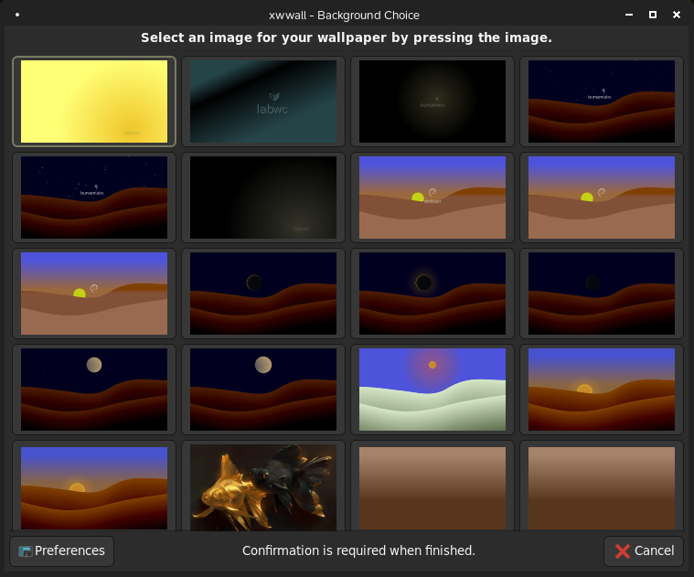

# xwwall
Graphical wallpaper setter for X11 and Wayland

## Screen shot



## What is this?
**xwwall** is a graphical wallpaper setter for the X Window System
often known as **X11** and **Wayland** desktops for Linux and other
\*nix distributions. It should run in light weight desktop environments
like Openbox, fluxbox, JWM for X11 and Labwc, Sway and others for
Wayland. It supports up to 6 monitors. It is a shell script written
in **bash**.
It requires **Gtk3dialog** for the graphical user interface which is
a gtk+-3.0 based UI program that describes dialog boxes from a shell
script.
In X11 it utilises **feh** as the engine to set the wallpaper and
**xrandr** to get screen dimensions and placement of monitors.
In Wayland it uses **swaybg** to set wallpapers and **wlr-randr** for
screen dimensions and placement.

## Why?
There are not many graphical wallpaper setters for both X11 and Wayland.
This is inspired by [Nitrogen](https://github.com/l3ib/nitrogen) and 
[Azote](https://github.com/nwg-piotr/azote).

Nitrogen only supports X11 and uses the old GTK+-2.0 library which
only runs on wayland with the help of Xwayland server but it's of no
use because the backend doesn't support wayland wallpaper setting.

Azote is fine and works well on both X11 and Wayland but I decided that
another alternative is worth pursuing.

## NOTE
 - Large desktop environments *are not* supported (KDE, Gnome, Cinnamon,
 Mate, Xfce etc)
 - Lightweigt desktops for X11 where this _should_ work are:
   - Openbox
   - fluxbox
   - JWM
   - probably others
   
 - Lightweigt desktops for Wayland where this _should_ work are:
   - labwc
   - sway
   - hyprland
   - probably others
   
Tested on labwc, Openbox and sway as working.

## Requirements

 - [gtk3dialog](https://github.com/01micko/gtk3dialog)
 
### On X11
 
 - **feh**
 - **xrandr**

### On Wayland

 - **swaybg**
 - **wlr-randr**
 
## Build
as root
```
make install
```
Installs all files under `/usr/local/`
Otherwise, copy all relevant files to their appropriate locations
in your `$HOME` directory.

## Manual
For convenience there is a [Manual](man/xwall.1.rst) provided.

## Bugs
Report all bugs to [Issues](https://github.com/01micko/xwwall/issues)
